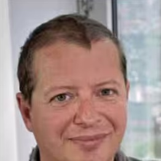
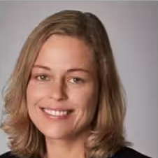
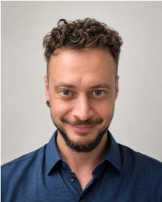
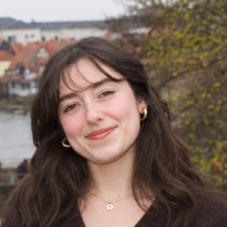

<!-- Generated by scripts/build_people.py. Edit that file, not this page. -->

::: {.person}

::: {.person-aside}

###  {#gyula-kovacs}

::: {.person-role}
, 
:::

::: {.person-social}

:::

::: {.person-email}
<a href="mailto:gyula.kovacs@uni-jena.de">gyula.kovacs<wbr>@uni-jena.de</a>
:::
:::

::: {.person-body}

Leitet die Forschung der Abteilung zu den neuronalen Grundlagen von Wahrnehmung und Kognition, darunter Objekt- und Personenerkennung, das Zusammenspiel von Wahrnehmung und Gedächtnis sowie prädiktive neuronale Prozesse. Die Arbeit verbindet Elektrophysiologie, funktionelle Bildgebung und transkranielle Magnetstimulation.

::: {.person-links}
[Mehr erfahren](){.pl-web}
:::

:::

:::

::: {.person}

::: {.person-aside}

### Dr. Mario Archila {#mario-archila}

::: {.person-role}
Wissenschaftlicher Mitarbeiter und Dozent für Neuro-KI und visuelle Wahrnehmung
:::

::: {.person-social}

:::

::: {.person-email}
<a href="mailto:mario.archila@uni-jena.de">mario.archila<wbr>@uni-jena.de</a>
:::
:::

::: {.person-body}

Arbeitet an der Schnittstelle von kognitiven Neurowissenschaften und maschinellem Lernen und wendet computergestützte Methoden auf neuronale und Verhaltensdaten an. Leitet das Forschungsprogramm Translational Neuro-AI am BPCN.

::: {.person-links}
[Mehr erfahren](){.pl-web}
:::

:::

:::

::: {.person}

::: {.person-aside}

### Susann Houben {#susann-houben}

::: {.person-role}
Teamassistenz
:::

::: {.person-email}
<a href="mailto:sekretariat.bpcn@uni-jena.de">sekretariat.bpcn<wbr>@uni-jena.de</a>
:::
:::

::: {.person-body}

Ansprechpartnerin für alle Fragen rund um die Abteilung und das Team von .

:::

:::

## Promovierende

::: {.person}

::: {.person-aside}

### András Sárközy, MSc {#andras-sarkozy}

::: {.person-role}
Promotion, 
:::

::: {.person-email}
<a href="mailto:andras.zoltan.sarkoezy@uni-jena.de">andras.zoltan.sarkoezy<wbr>@uni-jena.de</a>
:::
:::

::: {.person-body}

Die Forschung befasst sich mit Bewusstsein und bewusstem Zugang: wie und wann sensorische Information dem subjektiven Erleben und dem Bericht darüber zugänglich wird und wie Vorerwartungen dies prägen. Dazu kommen Psychophysik, Eyetracking, Pupillometrie und fMRT zum Einsatz. Ein zweiter Schwerpunkt ist die Neurodegeneration, zunächst aus molekulargenetischer Sicht und heute bei älteren und klinischen Gruppen untersucht, wobei Pupillometrie mit 7T-fMRT bei Aufgaben zu Aufmerksamkeit und kognitiver Kontrolle kombiniert wird. Veränderte Bewusstseinszustände, einschließlich psychedelischer Zustände, sind ein weiteres Interesse, das aus diesen Fragen erwächst.

:::

:::

::: {.person}

::: {.person-aside}

### Yang Shi, MSc {#yang-shi}

::: {.person-role}
Promotion, 
:::

::: {.person-social}

:::

::: {.person-email}
<a href="mailto:yang.shi@uni-jena.de">yang.shi<wbr>@uni-jena.de</a>
:::
:::

::: {.person-body}

Die Forschung befasst sich mit den vielfältigen Faktoren, die die Verarbeitung von Identität und das Vertrautwerden in sozialen Interaktionen prägen. Dazu werden EEG und fMRT mit multivariaten Analysen auf Basis maschinellen Lernens kombiniert, um die neuronalen Repräsentationen und Dynamiken der Personenwahrnehmung und Vertrautheit zu untersuchen.

:::

:::

::: {.person}

::: {.person-aside}

### Yeliz Dinc, MSc {#yeliz-dinc}

::: {.person-role}
Promotion, 
:::

::: {.person-social}

:::

::: {.person-email}
<a href="mailto:yeliz.dinc@uni-jena.de">yeliz.dinc<wbr>@uni-jena.de</a>
:::
:::

::: {.person-body}

Die Forschung befasst sich mit Gesichtswahrnehmung und Gesichtererkennung, insbesondere mit Vertrautheit, Gedächtnis und individuellen Unterschieden in der Fähigkeit, Gesichter zu erkennen, sowie damit, wie semantische Information und visueller Kontext die Verarbeitung und Erkennung von Identitäten prägen. Mit EEG und multivariater Musteranalyse untersucht diese Arbeit die neuronalen Prozesse der Gesichtererkennung. Außerdem lehrt sie im EmPra-Kurs „Face Recognition in Cognitive Neuroscience“. Außerhalb des Labors verbringt Yeliz gern Zeit mit ihrer Katze, in der Natur, mit gutem Essen und beim Sport.

:::

:::

## Studentische Hilfskräfte

::: {.person .alum}

::: {.person-body}

#### Marie Stöhr {#marie-stoehr}

::: {.person-role}
Studentische Tutorin
:::

::: {.person-email}
<a href="mailto:marie.stoehr@uni-jena.de">marie.stoehr<wbr>@uni-jena.de</a>
:::

:::

:::

::: {.person .alum}

::: {.person-body}

#### Nour Ogeiz {#nour-ogeiz}

::: {.person-role}
Studentische Hilfskraft
:::

::: {.person-email}
<a href="mailto:nour.ogeiz@uni-jena.de">nour.ogeiz<wbr>@uni-jena.de</a>
:::

:::

:::

## Alumni

Ehemalige wissenschaftliche Mitarbeitende sowie Studierende, die von  betreut wurden, auch vor seinem Wechsel an die Friedrich-Schiller-Universität Jena. Ein Kreuz (†) kennzeichnet eine Betreuung als Zweitgutachter.

### Ehemalige wissenschaftliche Mitarbeitende {.alumni-group}

::: {.person .alum}

::: {.person-body}

#### Dr. Lars Rogenmoser {#lars-rogenmoser}

::: {.person-role}
Ehemaliger Habilitand
:::

::: {.person-now}
Heute: Assistant Professor, James Madison University, USA
:::

::: {.person-social}

:::

:::

:::

::: {.person .alum}

::: {.person-body}

#### Dr. Géza Gergely Ambrus {#geza-gergely-ambrus}

::: {.person-role}
Ehemaliges Mitglied
:::

::: {.person-now}
Heute: Lecturer in Psychology, Bournemouth University, Vereinigtes Königreich
:::

::: {.person-social}

:::

:::

:::

### Promovierte Alumni {.alumni-group}

::: {.person .alum}

::: {.person-body}

#### Dr. Linda Ficco {#linda-ficco}

::: {.person-role}
Promotion 2024 †
:::

::: {.person-now}
Heute: Wissenschaftlerin, Swiss Center for Design and Health, Schweiz
:::

::: {.person-social}

:::

:::

:::

::: {.person .alum}

::: {.person-body}

#### Dr. Chenglin Li {#chenglin-li}

::: {.person-role}
Promotion 2022
:::

::: {.person-now}
Heute: School of Psychology, Zhejiang Normal University, China
:::

::: {.person-social}

:::

:::

:::

::: {.person .alum}

::: {.person-body}

#### Dr. Charlotta Eick {#charlotta-eick}

::: {.person-role}
Promotion 2021
:::

::: {.person-social}

:::

:::

:::

::: {.person .alum}

::: {.person-body}

#### Dr. Sophie-Marie Rostalski {#sophie-marie-rostalski}

::: {.person-role}
Promotion 2021
:::

::: {.person-social}

:::

:::

:::

::: {.person .alum}

::: {.person-body}

#### Dr. Petra Kovács {#petra-kovacs}

::: {.person-role}
Promotion 2018
:::

:::

:::

::: {.person .alum}

::: {.person-body}

#### Dr. Catarina Amado {#catarina-amado}

::: {.person-role}
Promotion 2017
:::

::: {.person-social}

:::

:::

:::

::: {.person .alum}

::: {.person-body}

#### Dr. Claudia Menzel {#claudia-menzel}

::: {.person-role}
Promotion 2016 †
:::

::: {.person-now}
Heute: Wissenschaftlerin, Umweltpsychologie, RPTU Kaiserslautern-Landau
:::

::: {.person-social}

:::

:::

:::

::: {.person .alum}

::: {.person-body}

#### Dr. Marlena Itz {#marlena-itz}

::: {.person-role}
Promotion 2016 †
:::

::: {.person-now}
Heute: Arbeitsgruppe Systems Neuroscience in Psychiatry, Zentralinstitut für Seelische Gesundheit, Mannheim
:::

:::

:::

::: {.person .alum}

::: {.person-body}

#### Dr. Lisa Münke {#lisa-muenke}

::: {.person-role}
Dr. med. 2016
:::

:::

:::

::: {.person .alum}

::: {.person-body}

#### Dr. Kornél Németh {#kornel-nemeth}

::: {.person-role}
Promotion 2016
:::

:::

:::

::: {.person .alum}

::: {.person-body}

#### Dr. Pál Vakli {#pal-vakli}

::: {.person-role}
Promotion 2016
:::

::: {.person-now}
Heute: Wissenschaftlicher Mitarbeiter, Brain Imaging Centre, HUN-REN Research Centre for Natural Sciences, Budapest, Ungarn
:::

:::

:::

::: {.person .alum}

::: {.person-body}

#### Dr. Mareike Grotheer {#mareike-grotheer}

::: {.person-role}
Promotion 2015
:::

::: {.person-now}
Heute: Professorin, Philipps-Universität Marburg
:::

::: {.person-social}

:::

:::

:::

::: {.person .alum}

::: {.person-body}

#### Dr. Christian Walther {#christian-walther}

::: {.person-role}
Promotion 2013
:::

:::

:::

::: {.person .alum}

::: {.person-body}

#### Dr. Krisztina Nagy {#krisztina-nagy}

::: {.person-role}
Promotion 2012
:::

:::

:::

::: {.person .alum}

::: {.person-body}

#### Dr. Nicole Wolff {#nicole-wolff}

::: {.person-role}
Promotion 2012 †
:::

::: {.person-now}
Heute: Klinik und Poliklinik für Kinder- und Jugendpsychiatrie und -psychotherapie, Universitätsklinikum Carl Gustav Carus Dresden
:::

::: {.person-social}

:::

:::

:::

::: {.person .alum}

::: {.person-body}

#### Dr. Márta Zimmer {#marta-zimmer}

::: {.person-role}
Promotion 2010
:::

::: {.person-now}
Heute: Associate Professor, Department of Cognitive Science, Technische und Wirtschaftswissenschaftliche Universität Budapest, Ungarn
:::

:::

:::

::: {.person .alum}

::: {.person-body}

#### Dr. Nadine Kloth {#nadine-kloth}

::: {.person-role}
Promotion 2009 †
:::

::: {.person-now}
Heute: Klinik für Neurologie, Universitätsklinikum Münster
:::

::: {.person-social}

:::

:::

:::

::: {.person .alum}

::: {.person-body}

#### Dr. Zoltán Chadaide {#zoltan-chadaide}

::: {.person-role}
Promotion 2003 †
:::

:::

:::

::: {.person .alum}

::: {.person-body}

#### Dr. Tamás Tompa {#tamas-tompa}

::: {.person-role}
Promotion 2003 †
:::

::: {.person-now}
Heute: Professor, Universität Miskolc, Ungarn
:::

:::

:::

### Master-, Diplom- und medizinische Abschlussarbeiten {.alumni-group}

Wer anschließend in der Abteilung promoviert hat, ist unter den promovierten Alumni aufgeführt.

::: {.thesis-list}
- **Antonia Viel**, MSc Psychologie, 2026
- **Isabell Jakob**, MSc Psychologie, 2025
- **Mayla te Veer** †, MSc Psychologie, 2025
- **Veronique Mann** †, MSc Psychologie, 2024
- **Elena Giuliani**, MSc Psychologie, 2022
- **Katherine Schulte** †, MSc Psychologie, 2022
- **Theresa Epperlein** †, MSc Psychologie, 2022
- **Hanna Klink**, MSc Psychologie, 2021
- **Alexia Dalski** †, MSc Psychologie, 2021. Heute: [Doktorandin, Philipps-Universität Marburg](https://www.uni-marburg.de/en/fb04/team-grotheer/team/alexia-dalski)
- **Rico Stecher**, MSc Psychologie, 2020
- **Philipp Böhm**, MSc Psychologie, 2019
- **Christian Bloszies** †, MSc Psychologie, 2019
- **Fabian Kattlun** †, MSc Psychologie, 2019
- **Lisa-Celine Sullwold** †, MSc Psychologie, 2018
- **Viola Wagner**, MSc Psychologie, 2017
- **Rebecca Mayer**, MSc Psychologie, 2016
- **Maria Dotzer** †, MSc Psychologie, 2016
- **Nadin Wanke**, MSc Psychologie, 2015
- **Jacob Itzhaki**, MSc Kognitive Neurowissenschaften, 2013
- **Daniel Kaiser**, Diplom (Psychologie), 2012. Heute: Professor für Neural Computation, Justus-Liebig-Universität Gießen
- **Iulia Lavric**, Diplom (Psychologie), 2012
- **Lara Iffland**, MSc Kognitive Neurowissenschaften, 2012
- **Alexander Lüttich**, MSc Kognitive Neurowissenschaften, 2012. Heute: [Postdoktorand, Nuffield Department of Clinical Neurosciences, University of Oxford](https://www.ndcn.ox.ac.uk/team/alexander-luettich)
- **Zsófia Szabó**, MSc Kognitive Neurowissenschaften, 2011
- **Marcin Posel**, Diplom (Psychologie), 2011
- **Csaba Cziraki**, Diplom (Psychologie), 2010
- **Wenrui Liu**, MSc Kognitive Neurowissenschaften, 2010
- **Krisztina Kovács**, Diplom (Psychologie), 2009
- **Zsanett Zsadányi**, Diplom (Psychologie), 2008
- **Irén Harza**, Diplom (Biologie), 2006
- **Éva Bankó**, Diplom (Biologie), 2005. Heute: Senior Research Fellow, HUN-REN Research Centre for Natural Sciences, Budapest
- **Béla Csákány**, Medizinische Abschlussarbeit, 2004. Heute: Klinik für Augenheilkunde, Semmelweis-Universität Budapest
- **Gábor Csifcsák**, Medizinische Abschlussarbeit, 2004. Heute: Professor für Kognitive Neurowissenschaften, UiT The Arctic University of Norway
:::

### Bachelorarbeiten {.alumni-group}

::: {.thesis-list .thesis-list-compact}
- **Marie Stöhr**, 2026
- **Aaron Jakobi**, 2025
- **Anna-Lena Wühr**, 2025
- **Annika Thiel**, 2025
- **Azlia Istiqomah** †, 2025
- **Emma Lippold**, 2025
- **Jakob Menkens**, 2025
- **Lena Breidt** †, 2025
- **Lotta Ulrich** †, 2025
- **Moritz Iffland**, 2025
- **Sophie Mintert** †, 2025
- **Anna Seeber**, 2024
- **Jennifer Kroker** †, 2024 (Biologie)
- **Lara Wöhmann** †, 2024
- **Lisa Göschel**, 2024
- **Richard Jahn**, 2024 (Biologie)
- **Robert Mathaus**, 2024
- **Sophia Pawlik**, 2024
- **Dominic Kühnlein**, 2023
- **Dorothea Eichentopf** †, 2022
- **Janine Sommerfeld** †, 2021
- **Klemens Buttgereit**, 2021 (Biologie)
- **Laura Friedrich**, 2021
- **Louisa Fortwengel**, 2021
- **Pauline Wetzel**, 2021
- **Anna Erlenbusch** †, 2020
- **Johannes Lehnen**, 2020
- **Laura Froese** †, 2020
- **Lukas Korn**, 2020
- **Marian Losse** †, 2020
- **Marie Wachter**, 2020
- **Paulina Michal** †, 2020
- **Soyoung Jeong** †, 2020
- **Lu Steinhauer**, 2019
- **Moriz Stabe**, 2019
- **Ricarda Maria Budny**, 2019
- **Sophia Karzai**, 2019
- **Bahar Aydin** †, 2018
- **Dario Urban** †, 2018
- **Sandrine Hinrichs**, 2018
- **Antonia Eisele** †, 2017
- **Anna Trimborn** †, 2017
- **Fabienne Windel** †, 2017
- **Laura Krohn** †, 2017
- **Madita Linke**, 2016
- **Polina Stoyanova**, 2016
:::

---

*Um ein Profil zu ergänzen oder zu korrigieren, eröffnen Sie eine [Änderungsanfrage](https://github.com/bpcn-lab/bpcn-lab.github.io/issues/new/choose).*
