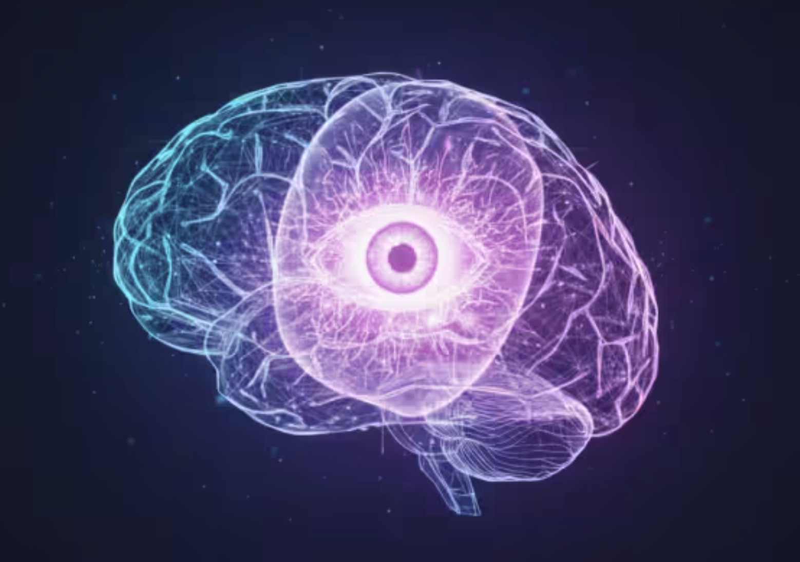

Unsere Forschung fragt, wie das Gehirn das, was die Augen aufnehmen, in Erkennen, Vorhersage und Bewusstsein verwandelt. Die Seite hat zwei Teile: Die **Themen** sind die Fragen, die wir untersuchen, die **Methoden** sind die Wege, auf denen wir sie untersuchen.

## Forschungsthemen

### Vertraute Gesichter und Personen erkennen

Menschen, die wir kennen, erkennen wir im Bruchteil einer Sekunde. Dennoch gehört dies zu den schwierigsten Aufgaben des visuellen Systems: Ein einziger Blick muss in die Gewissheit „das ist eine bestimmte Person, die ich kenne“ übersetzt werden. Ein großer Teil der jüngeren Arbeiten der Abteilung fragt, wie ein Gesicht vertraut wird, wie das Gehirn eine bekannte Identität anders repräsentiert als eine fremde und wie schnell sich diese Repräsentation bildet. Neuere Studien haben den *Grad* der Vertrautheit in der Hirnantwort gemessen, die neuronale Signatur verfolgt, die beim Lernen eines neuen Gesichts entsteht, und gezeigt, dass auch Informationen jenseits des Bildes, etwa die Biografie einer Person, prägen, wie ihre Identität repräsentiert wird.

### Vorhersagen, was wir sehen: Erwartung und Wiederholung

Das Gehirn ist keine passive Kamera. Es sagt ständig voraus, was als Nächstes wahrscheinlich erscheint, und seine Antwort auf einen erwarteten oder wiederholten Reiz fällt meist geringer aus, ein Effekt, der als **Repetition Suppression** bezeichnet wird. Eine zentrale Frage ist, ob diese Abschwächung echte Vorhersage widerspiegelt oder eine einfachere Form der Adaptation. Neuere Studien trennen beides, indem sie die Wahrscheinlichkeit eines Reizes variieren, seinen Kontext verändern oder Teilnehmende trainieren, und eine Metaanalyse hat die Belege für ein hirnweites Vorhersagenetzwerk abgewogen.

### Objekte, Szenen und geschriebene Wörter erkennen

Gesichter sind nicht das Einzige, was wir erkennen. Dieselben Fragen nach Vertrautheit und Vorhersage betreffen auch Alltagsgegenstände, reale Orte und geschriebene Wörter. Neuere Arbeiten fragen, ob eine persönlich vertraute Szene wie ein vertrautes Gesicht kodiert wird, ob eine kurze Stimulation des objektselektiven Kortex das Entdecken und Kategorisieren von Objekten verändert und wie Leseerfahrung und Sprachkenntnis die auf geschriebene Wörter spezialisierte Hirnregion prägen.

### Bewusstsein und visuelle Wahrnehmung

Warum gelangt manche visuelle Information ins Bewusstsein und andere nicht? Ein jüngerer Strang der Arbeit der Abteilung setzt sich direkt mit Bewusstseinstheorien auseinander, auch in großen adversarialen Kollaborationen, in denen konkurrierende Theorien an gemeinsamen Vorhersagen geprüft werden. Um die Grenze zwischen Sehen und dem Bewusstsein des Sehens zu untersuchen, nutzen wir Phänomene wie die **bewegungsinduzierte Blindheit**, bei der ein deutlich sichtbares Objekt kurz aus dem Bewusstsein verschwindet, obwohl es auf dem Bildschirm bleibt.

## Methoden

Die Abteilung verbindet Elektrophysiologie, Bildgebung und Hirnstimulation mit Verhaltensexperimenten und computergestützter Analyse. Sie betreibt drei eigene Labore, ein **TMS-Labor**, ein **Eyetracking-Labor** und ein **Hörlabor**, und hat Zugang zu funktioneller Bildgebung.

### Elektroenzephalografie (EEG) und ereigniskorrelierte Potenziale

Das EEG misst die elektrische Aktivität des Gehirns an der Kopfhaut mit Millisekundengenauigkeit. Da Erkennen und Vorhersagen in Sekundenbruchteilen ablaufen, können wir mit dem EEG den zeitlichen Verlauf der Wahrnehmung verfolgen und fragen, *wann* und nicht nur wo das Gehirn ein vertrautes Gesicht unterscheidet oder einen erwarteten Reiz registriert.

### Funktionelle Magnetresonanztomografie (fMRT)

Die fMRT zeigt, *wo* Antworten entstehen, indem sie kleine Veränderungen der Sauerstoffsättigung des Blutes erfasst. Die Abteilung nutzt sie vor allem, um Repetition Suppression und Adaptation zu lokalisieren und zu zeigen, welche Regionen ihre Antwort verringern, wenn ein Reiz wiederholt, erwartet oder im Gedächtnis gehalten wird.

### Transkranielle Magnetstimulation (TMS)

Die TMS verändert mit kurzen Magnetimpulsen die Aktivität einer gezielten Region, nicht invasiv und reversibel, auch mit gemusterten Protokollen wie der kontinuierlichen Theta-Burst-Stimulation (cTBS). Im **TMS-Labor** der Abteilung erlaubt es die gezielte Störung einer Region und die Messung ihrer Folgen für Verhalten oder EEG, von Korrelationen zu kausalen Tests überzugehen: Welche Regionen sind für das Erkennen tatsächlich notwendig?

### Eyetracking

Eyetracking erfasst Millisekunde für Millisekunde, wohin die Augen blicken und wie lange. Im **Eyetracking-Labor** zeigt dies, was Aufmerksamkeit auf sich zieht und wie Menschen ein Gesicht oder eine Szene abtasten, und es lässt sich mit dem EEG kombinieren, um den Moment des Hinsehens mit der Hirnantwort zu verbinden.

### Auditive Methoden

Nicht jedes Erkennen ist visuell. Das **Hörlabor** untersucht das Hören, etwa wie wir Stimmen erkennen und Sprache wahrnehmen, mit genau kontrollierten Klängen und Elektrophysiologie. Dies ergänzt die visuelle Forschung und fragt, ob das Gehirn eine vertraute Stimme so behandelt wie ein vertrautes Gesicht.

### Multivariate Musteranalyse und neuronales Dekodieren

Statt nur zu fragen, ob eine Region stärker aktiv ist, fragt das Dekodieren, welche Information ihr Aktivitätsmuster enthält. Auf zeitlich aufgelöste EEG-Daten angewandt, zeigt es, wie die Repräsentation eines Gesichts oder einer Identität entsteht, sich mit der Zeit schärft und sogar über getrennte Experimente hinweg verallgemeinert.

### Verhaltensexperimente und Psychophysik

Sorgfältig kontrollierte Aufgaben messen, was Menschen tatsächlich wahrnehmen und wie schnell sie reagieren. Verhaltensmethoden verankern die neuronalen Befunde und legen bei Täuschungen wie der bewegungsinduzierten Blindheit die Lücke offen zwischen dem, was auf dem Bildschirm ist, und dem, was ins Bewusstsein gelangt.

### Metaanalyse und systematische Übersichtsarbeit

Die Abteilung fasst auch Befunde aus vielen Studien zusammen. Quantitative Metaanalysen und systematische Übersichtsarbeiten prüfen, ob Effekte wie die Erwartungssuppression oder die Existenz eines Vorhersagenetzwerks in der breiteren Literatur verlässlich Bestand haben.

### Generative KI

Generative Modelle, darunter tiefe neuronale Netze, die lernen, Gesichter, Objekte und Szenen zu erzeugen, erlauben eine genaue Kontrolle über die untersuchten Bilder und liefern eine computergestützte Erklärung dafür, wie das Gehirn sie repräsentieren könnte. Der Vergleich menschlicher Hirnantworten mit den internen Repräsentationen dieser Modelle prüft, welche Rechenprinzipien das visuelle System tatsächlich nutzt. Dieser Bereich wird in der Abteilung von Dr. Mario Archila geleitet.

[Mehr erfahren](/research.html#generative-ai)

### Computergestützte Modellierung

Computermodelle übersetzen eine Wahrnehmungstheorie in Gleichungen mit überprüfbaren Vorhersagen, von Predictive-Coding-Ansätzen zur Erwartung bis zu Modellen, wie Identität über die Zeit kodiert wird. Werden diese Modelle an Hirn- und Verhaltensdaten angepasst, zeigt sich, ob ein vorgeschlagener Mechanismus das Beobachtete tatsächlich hervorbringen kann. Dieser Bereich wird in der Abteilung von Dr. Mario Archila geleitet.

[Mehr erfahren](/research.html#computational-modeling)

## Kooperationen

Die Abteilung arbeitet mit Kolleginnen und Kollegen in Deutschland und im Ausland zusammen, darunter:

- Prof. Dr. Stefan Schweinberger, Friedrich-Schiller-Universität Jena
- Prof. Dr. Andrea Antal, Universität Göttingen
- Dr. Sabrina Trapp, Universität Bielefeld
- Prof. Dr. Daniel Kaiser, Justus-Liebig-Universität Gießen
- Dr. Rufin Vogels, KU Leuven, Belgien
- Dr. Zoltán Vidnyánszky, Budapest, Ungarn
- Dr. Mihály Racsmány, Technische und Wirtschaftswissenschaftliche Universität Budapest, Ungarn
- Prof. Dezső Németh, Université Claude Bernard Lyon 1, Frankreich
- Dr. Viljami Salmela, Universität Helsinki, Finnland
- Assoc. Prof. Patrick Johnston, Queensland University of Technology, Brisbane, Australien
- Dr. Daniel Feuerriegel, University of Melbourne, Australien
- Prof. Jakob Hohwy und Dr. Jonathan Robinson, Monash University, Melbourne, Australien
