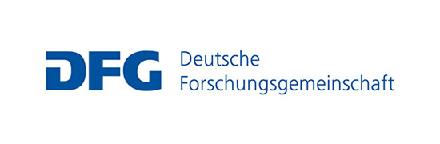

::: {.hero}
# Biological Psychology & Cognitive Neuroscience

::: {.lede}
Investigating the neural background of perceptual and cognitive functions at Friedrich Schiller University Jena.
:::
:::

The **** () is part of the  at , led by . We study how the brain supports perception, memory, and cognition, with a focus on object and person recognition, the interaction between perception and memory, and predictive neural processes.

## Research themes

::: {.card-grid}
::: {.card}
### Recognizing familiar faces and people
How a face becomes familiar, and how the brain represents a known identity differently from a stranger's.
:::
::: {.card}
### Predicting what we see
How expectation shapes perception, and whether repetition suppression reflects genuine prediction.
:::
::: {.card}
### Recognizing objects, scenes, and written words
The same questions of familiarity and prediction, extended to objects, real-world scenes, and reading.
:::
::: {.card}
### Consciousness and visual awareness
Why some visual information reaches awareness, probed with theories of consciousness and illusions such as motion-induced blindness.
:::
:::

[Explore our research →](research.qmd)

## Methods & facilities

We combine electroencephalography (EEG), functional imaging (fMRI), transcranial magnetic stimulation (TMS), and eye-tracking. The department operates dedicated **TMS**, **Eye-Tracking**, and **Auditory** laboratories.

## Take part in our research

::: {.callout-cta}
Much of our research depends on volunteers from Jena and beyond. Taking part is safe, non-invasive, and reimbursed, and it directly advances our understanding of how the brain perceives and remembers.

[Become a participant](participants.qmd){.btn-fsu}
:::

## Get in touch

 · [](mailto:)

[Join us](join.qmd) · [People](people.qmd) · [Publications](publications.qmd)

## Funding

Our research is supported by:

::: {.funding-grid}
[{.funding-logo}](https://www.dfg.de/en)
[{.funding-logo}](https://www.humboldt-foundation.de/en)
:::
