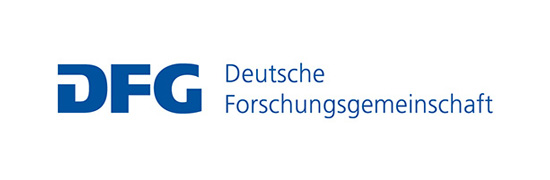

::: {.hero-full .column-screen}
```{=html}
<div class="hero-media">
  
</div>
<div class="hero-panel">
  <p class="hero-title" role="heading" aria-level="1">Biological Psychology &amp; Cognitive Neuroscience</p>
  <p class="hero-lede">Investigating the neural background of perceptual and cognitive functions at Friedrich Schiller University Jena.</p>
  <a class="hero-cta" href="research.html">Explore our research</a>
</div>
<button class="hero-motion" type="button" aria-pressed="false" aria-label="Pause background motion" hidden>
  <svg class="i-pause" viewBox="0 0 24 24" aria-hidden="true"><rect x="6" y="5" width="4" height="14" rx="1"/><rect x="14" y="5" width="4" height="14" rx="1"/></svg>
  <svg class="i-play" viewBox="0 0 24 24" aria-hidden="true"><path d="M8 5.5v13a1 1 0 0 0 1.5.86l10.5-6.5a1 1 0 0 0 0-1.72L9.5 4.64A1 1 0 0 0 8 5.5z"/></svg>
</button>
<script>
(() => {
  if (matchMedia("(prefers-reduced-motion: reduce)").matches) return;
  const hero = document.currentScript.closest(".hero-full");
  const btn = hero.querySelector(".hero-motion");
  hero.classList.add("is-moving");
  btn.hidden = false;
  btn.addEventListener("click", () => {
    const paused = hero.classList.toggle("is-paused");
    btn.setAttribute("aria-pressed", String(paused));
    btn.setAttribute("aria-label", paused ? "Play background motion" : "Pause background motion");
  });
})();
</script>
```
:::

The **** () is part of the [Institute of Psychology]() in the []() at [](). We study how the brain supports perception, memory, and cognition, with a focus on object and person recognition, the interaction between perception and memory, and predictive neural processes.

## Research themes

::: {.card-grid}
::: {.card}
### Recognizing familiar faces and people
How a face becomes familiar, and how the brain represents a known identity differently from a stranger's.
:::
::: {.card}
### Predicting what we see
How expectation shapes perception, and whether repetition suppression reflects genuine prediction.
:::
::: {.card}
### Recognizing objects, scenes, and written words
The same questions of familiarity and prediction, extended to objects, real-world scenes, and reading.
:::
::: {.card}
### Consciousness and visual awareness
Why some visual information reaches awareness, probed with theories of consciousness and illusions such as motion-induced blindness.
:::
:::

[Explore our research →](research.qmd)

## Latest publications

- Dinç Y, Shi Y, Kovács G. **The neural dynamics of familiarity representation during cued recall.** *bioRxiv* preprint, 2026. [DOI](https://doi.org/10.64898/2026.09.21.753245) · [Video](/media/preprint-dinc-2026.mp4)
- Menkens J, Bräuer J, Kovács G. **Of dogs and men: recognising one's own dog engages the same neural processes as recognising personally familiar faces.** *Biological Psychology*, 2026. [DOI](https://doi.org/10.1016/j.biopsycho.2026.109359)
- Shi Y, Gommlich S, Kovács G. **It matters who you are: biography modulates the neural dynamics of facial identity representation.** *Cerebral Cortex*, 2026. [DOI](https://doi.org/10.1093/cercor/bhag010)

[All publications →](publications.qmd)

## Methods & facilities

We combine electroencephalography (EEG), functional imaging (fMRI), transcranial magnetic stimulation (TMS), and eye-tracking. The department operates dedicated **TMS**, **Eye-Tracking**, and **Auditory** laboratories.

## Take part in our research

::: {.callout-cta}
Much of our research depends on volunteers from Jena and beyond. Taking part is safe, non-invasive, and reimbursed, and it directly advances our understanding of how the brain perceives and remembers.

[Become a participant](participants.qmd){.btn-fsu}
:::

## Get in touch

 · [](mailto:)

[Join us](join.qmd) · [People](people.qmd) · [Publications](publications.qmd)

## Funding

Our research is supported by:

::: {.funding-grid}
[{.funding-logo}](https://www.dfg.de/en)
[{.funding-logo}](https://www.humboldt-foundation.de/en)
:::
